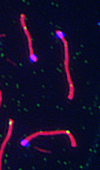

## Mini macro repo

This macro which runs on imageJ has been written to analyze and quantify features of immunofluorescence prophase I meiocytes. Specifically the goals for this macro are to 1) measure the length of red shapes (bivalents Synaptonemal Complex (SC) ), 2) calculate the chromosome region that MLH1 foci occur (as percentage of SC length and 3) measure the interfocal distance of bivalents with more than 2 foci.
Trying to design a pipeline to link together the 3 macros.

process_macro1.ijm
Runs on a 'main' directory with several images. Creates a new folders (SC folders) for each image filled with cropped SC images.

process_macro2.ijm
Runs on directories (SC folders) with the cropped SC images. Calculates the object class and moves 'bad' images to a discard folder.

process_macro3.ijm
Runs on directories (SC folders) with 'good' SCs, creates a txt file with the SC measures (length, foci positions).

Running these macros.
Open macro 1 in ImageJ, select an image folder. Run macro 2 and macro 3 on one of the newly made directories.
